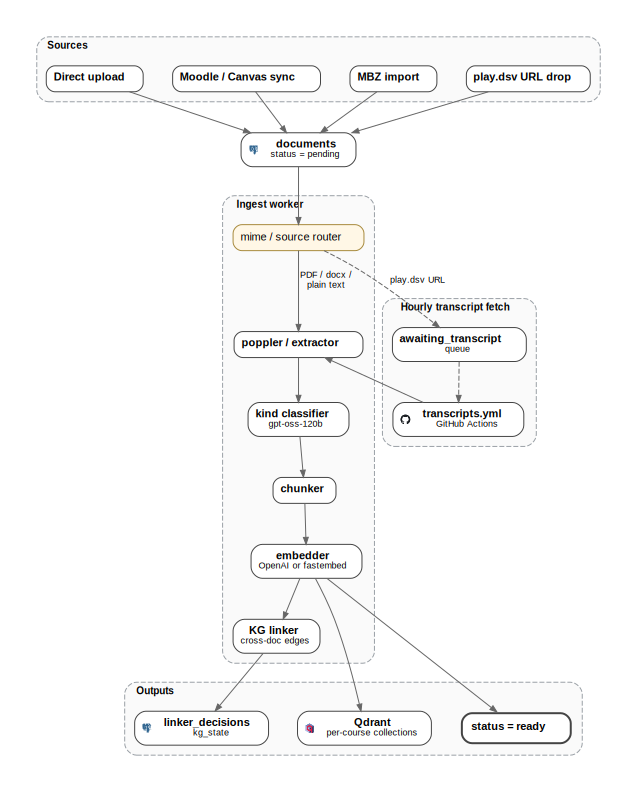
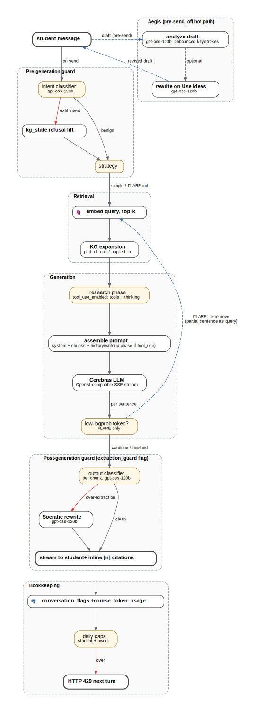

# Minerva architecture

The figures here are rendered from [`docs/diagrams/build.py`](diagrams/build.py)
(graphviz under the hood). To regenerate after editing:

```bash
sudo apt-get install graphviz
python3 -m venv /tmp/diags
/tmp/diags/bin/pip install graphviz diagrams
/tmp/diags/bin/python docs/diagrams/build.py
```

## System overview


Apache unsets identity headers `early` outside of `mod_shib` / Lua paths;
LMS, iframe, and service-account routes carry their own bearer-token or
HMAC-signed-token middleware. Double-headed arrows indicate read/write
relationships; single-headed arrows are push-only.

## Document ingest pipeline



The kind classifier runs *before* chunking, so assignments and solutions can
be excluded from prompt context for student-facing chats. Embeddings are
written to a per-course Qdrant collection versioned by
`(course_id, embedding_model)`; re-embedding under a new model is lazy and
the old version stays live until rotation finishes. The KG linker reads
excerpts and embeddings from Qdrant (no PDF re-parsing) and caches per-pair
decisions.

## Chat / RAG pipeline



Three strategies share retrieval, KG expansion, and the extraction-guard
layers; they differ in *when* retrieval happens relative to generation:

- **simple**: retrieve once, then generate.
- **parallel**: start streaming the LLM and run retrieval concurrently;
  splice context as soon as it lands.
- **FLARE**: multi-turn loop. Stream a sentence, score logprobs; if a
  token is low-confidence, use the partial sentence as a re-retrieval query
  and resume generation. Iteration is capped per response.

Classifiers run on `llama3.1-8b` for latency; the Socratic rewriter on
`gpt-oss-120b`. Every classifier decision is appended to
`conversation_flags` so teachers can audit activations from the
"Needs Review" tab.
