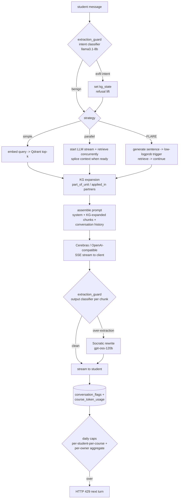

# Chat / RAG pipeline

Source: `backend/crates/minerva-server/src/chat/`. Three strategies share the
same retrieval, KG-expansion, and extraction-guard layers; they differ in
when retrieval happens relative to generation.

The intent classifier and per-chunk output classifier run on `llama3.1-8b`
for latency; the Socratic rewriter uses `gpt-oss-120b` because it needs to
produce coherent prose. Every classifier decision and rewrite is appended
to `conversation_flags` so teachers can audit activations from the
"Needs Review" tab.
