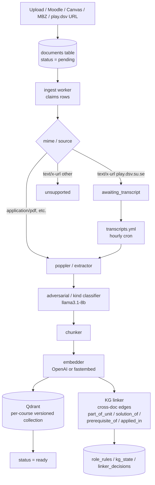

# Document ingest pipeline

Source: `backend/crates/minerva-ingest/`. Triggered when a teacher uploads a
file, the Moodle/Canvas sync registers a URL, or an MBZ import enqueues a
backup. The same state machine is used for all entry points.

Notes:

- The classifier runs *before* chunking so assignments and solutions can be
  tagged and excluded from prompt context for student-facing chats.
- Embeddings are written to a per-course Qdrant collection that is versioned
  by `(course_id, embedding_model)`. Re-embedding under a new model creates
  a new collection version; the old one stays live until the rotation
  finishes (lazy re-embed).
- The KG linker reads excerpts and embeddings *from Qdrant*; it does not
  re-parse the original PDFs. Decisions are cached per pair so untouched
  pairs are not re-evaluated.
