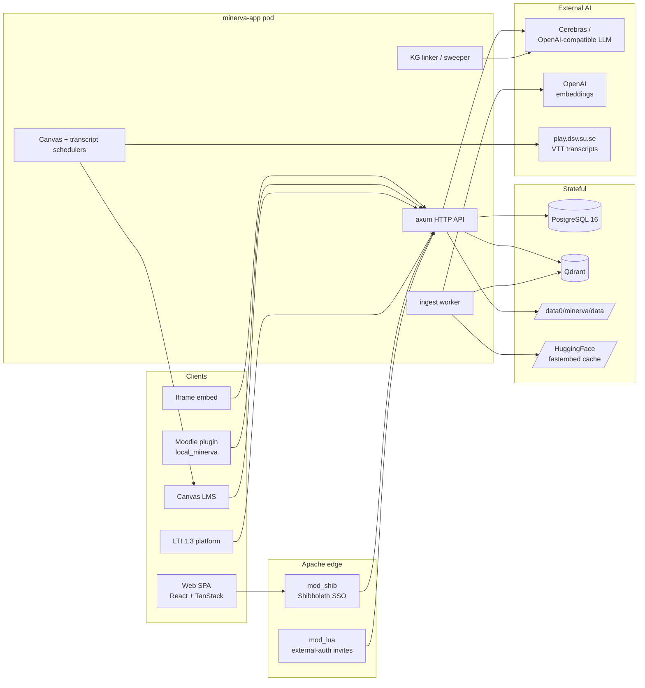

# System overview

Apache trust boundary: Shibboleth-issued identity headers and the Lua
external-auth headers are unset `early` for any request that does not come
through one of those two paths. Per-route exemptions for LMS / iframe /
service-account traffic are handled by their own bearer-token or
HMAC-signed-token middleware in the backend.
